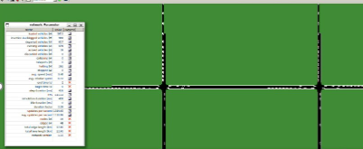
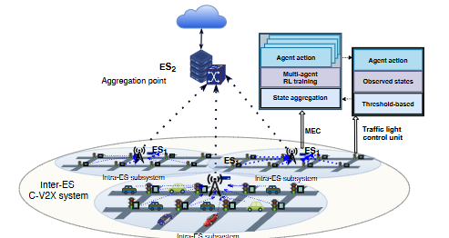

# Decentralized Reinforcement Learning at the Edge for Traffic Light Control



This repository contains a capstone project focused on smart traffic signal control in an edge/fog computing environment. The system combines a Java-based edge simulation, a reinforcement-learning inference service, and the iFogSim2 toolkit to model how distributed edge devices can manage traffic intersections more efficiently than traditional static control policies.

## Project Overview

The project explores an intelligent traffic management pipeline where:

- traffic conditions are sensed at each intersection,
- telemetry is processed at the edge layer,
- a DRLE (Deep Reinforcement Learning Edge) controller decides whether to hold or switch a traffic phase,
- and the decision is enacted back at the road network level.

This approach is intended to reduce congestion, shorten delays, and improve throughput in urban traffic networks by placing decision-making closer to the data source.

## System Architecture




## Repository Structure

- `edge-traffic-sim/` — Java-based edge traffic simulator built with iFogSim2 and YAML-driven configurations.
- `CI-traffic-sim/` — Python FastAPI service that exposes the RL decision endpoint for traffic-light control.
- `iFogSim/` — local iFogSim2 codebase used as the underlying fog/edge simulation framework.
- `Documentation/` — project report and presentation material.
- `.gitignore` — repository ignore rules.

## Key Components

### 1. Edge Traffic Simulation
The `edge-traffic-sim` module builds a fog topology and models multiple intersections with edge devices, sensors, and actuators. It can run under different control policies such as:

- `TIMER`
- `ACTUATED`
- `DRLE`

The simulation is configured via YAML files such as `edge-traffic-sim/configs/base-5x5.yaml` and is launched from `com.team.traffic.Runner`.

### 2. DRLE Server
The `CI-traffic-sim` module provides an HTTP API used by the edge simulation. It receives intersection observations and returns a recommended action (`HOLD` or `SWITCH`) based on a trained RL policy.

### 3. Fog/Edge Framework
The project uses iFogSim2 as the foundation for modeling fog resources, communication latency, and distributed edge infrastructure.

## Tech Stack

- Java 21+
- Apache Maven
- iFogSim2
- Python 3.9+
- FastAPI / Uvicorn
- YAML configuration files

## Prerequisites

Before running the project, install:

- Oracle JDK 21+
- Apache Maven
- Python 3.9+
- Git

## Quick Start

### Start the DRLE server

```bash
cd CI-traffic-sim
pip install -r requirements.txt
uvicorn ci_server:app --reload --host 0.0.0.0 --port 8000
```

### Run the edge simulation

```bash
cd edge-traffic-sim
mvn -q -DskipTests clean package
mvn -q dependency:copy-dependencies -DincludeScope=runtime -DoutputDirectory=target\deps

java -cp "target\edge-traffic-sim-0.1.0.jar;target\deps\*;<PATH_TO_IFOGSIM>\iFogSim\build\ifogsim2.jar;<PATH_TO_IFOGSIM>\lib\*" com.team.traffic.Runner --cfg configs\base-5x5.yaml
```

> Replace `<PATH_TO_IFOGSIM>` with the absolute path to the local `iFogSim` directory used in this project.

## Example Workflow

1. Start the DRLE server.
2. Launch the Java simulation with the configured grid.
3. The simulator generates intersection telemetry.
4. The control loop sends observations to the DRLE server.
5. The RL policy returns a traffic-light action.
6. Results are recorded for comparison with baseline policies.

## Expected Outputs

The project is designed to generate simulation metrics and comparisons such as:

- queue length
- average latency
- power consumption
- SLA miss rate
- halting percentage

These outputs help evaluate whether the edge-driven DRLE approach improves traffic operations over fixed-timing methods.

## Notes

This repository brings together two related research directions:

- edge/fog simulation with iFogSim2,
- and deep reinforcement learning for adaptive traffic control.

The combination provides a practical capstone use case for distributed systems, edge intelligence, and smarter urban mobility.

## License

The project includes a local copy of the iFogSim2 toolkit and its supporting materials. Please refer to the project-specific licenses in the included directories and the upstream iFogSim project documentation for usage terms.
